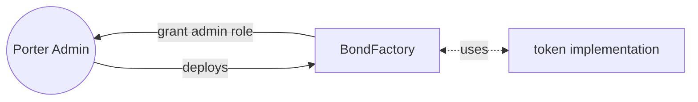
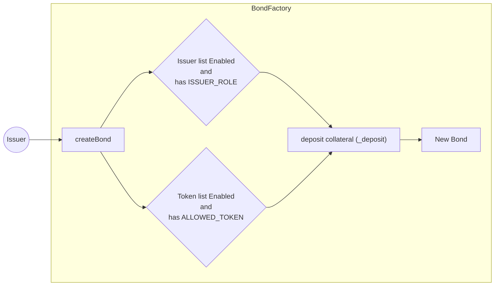
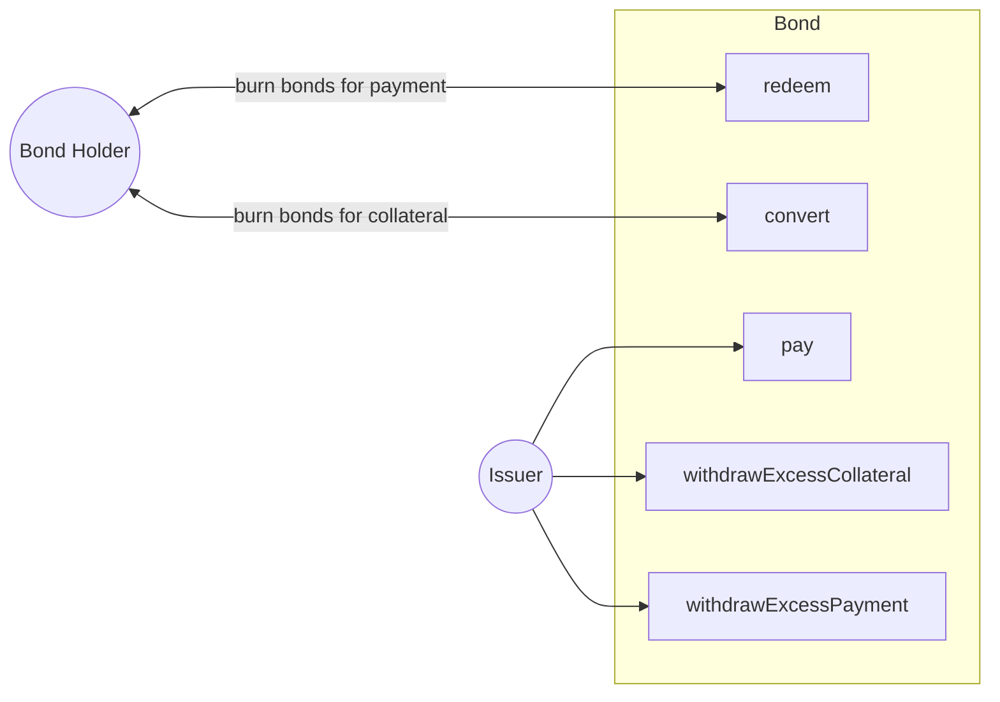
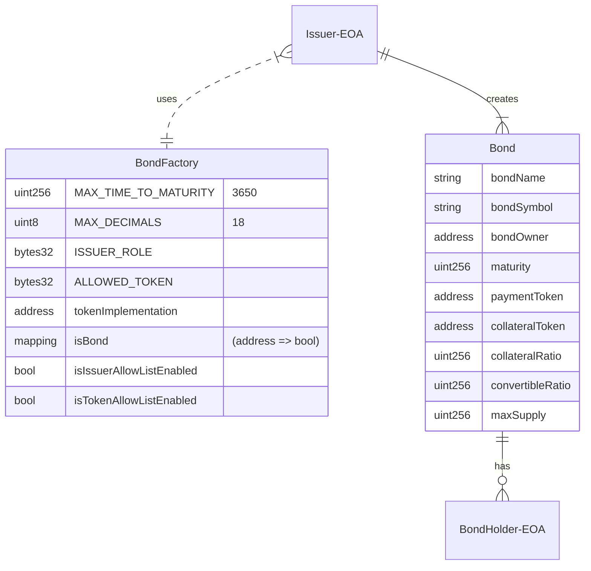

# V1 Architecture

# Flowcharts

## Initialize BondFactory Contract
The Bond Factory contract is deployed and created by the Porter Admin (multi-sig). The contract assigns the admin role to the deployer and the proxy contract is initialized with the token implementation (Bond contract).

## CreateBond
After the Bond Factory has been created, the issuer can create a Bond if they are on the allowed issuer list and the token used is on the allowed token list. The Bonds are created (minted) at the same time that the collateral is deposited.

## Bond Actions
Issuers and Bond Holders can both interact with the bond in a few ways.

## ER Diagram
There are two entities in the protocol. A Bond and a BondFactory.  

An Issuer (EOA) first creates a Bond comprised of many bond shares via the BondFactory. The Issuer can then distribute those bond shares to BondHolder(s) (EOA(s)).  

