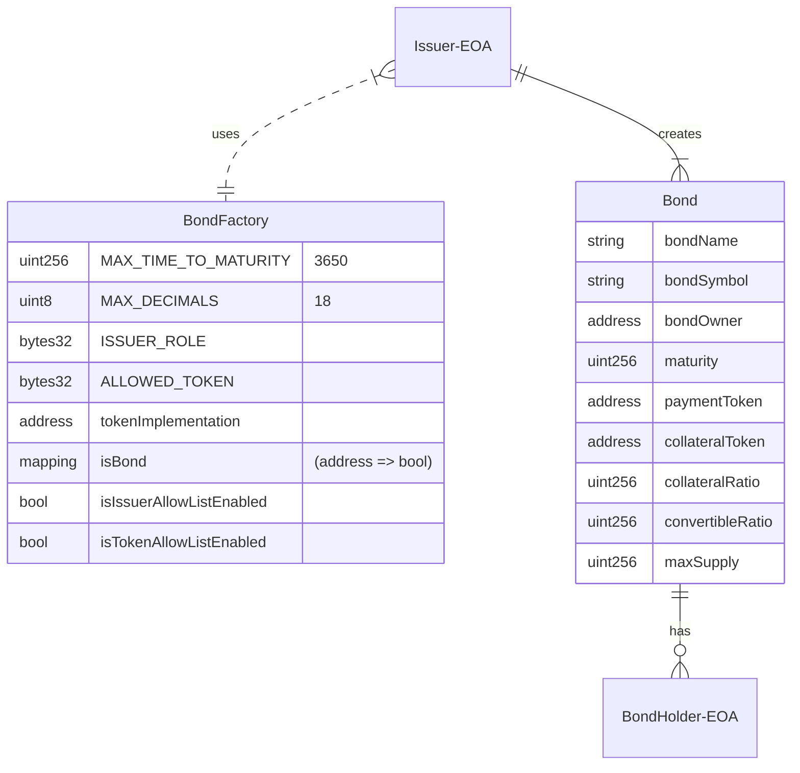

# V1 Architecture

## ER Diagram
There are two entities in the protocol. A Bond and a BondFactory.  

An Issuer (EOA) first creates a Bond comprised of many bond shares via the BondFactory. The Issuer can then distribute those bond shares to BondHolder(s) (EOA(s)).  

