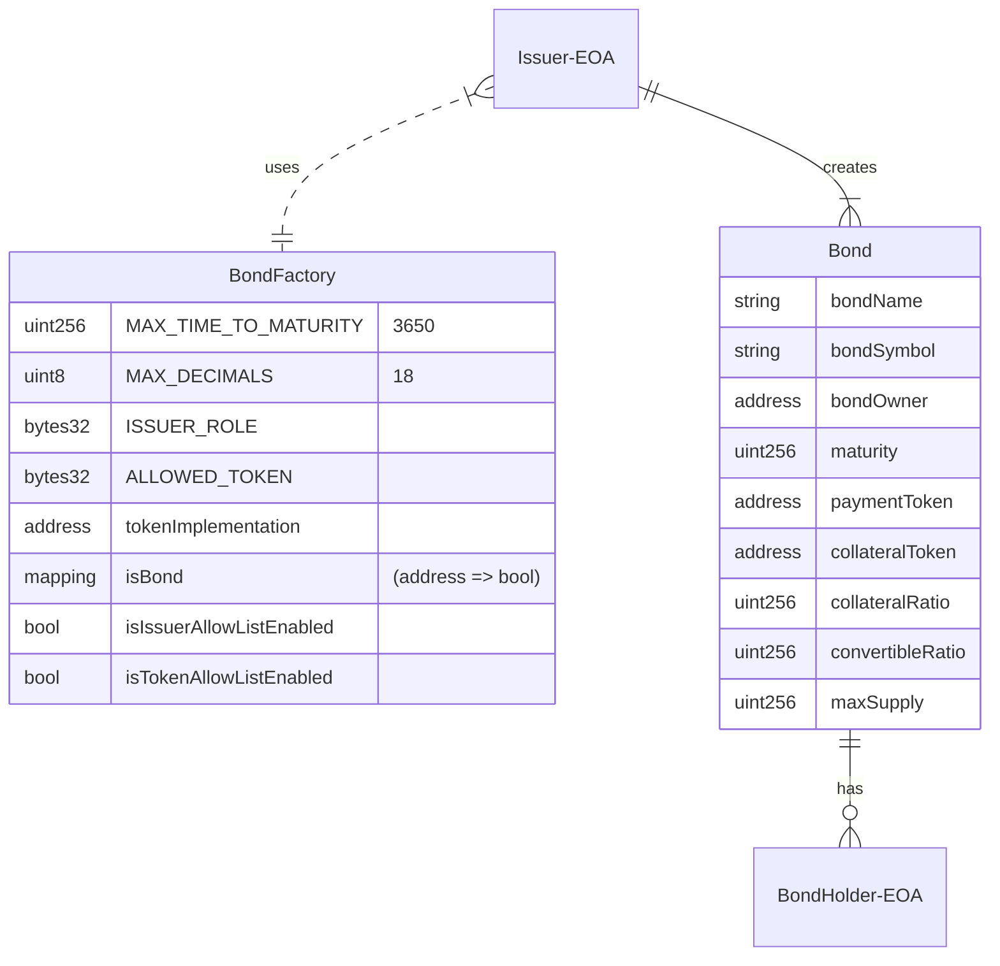
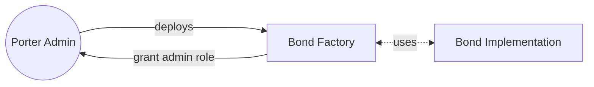
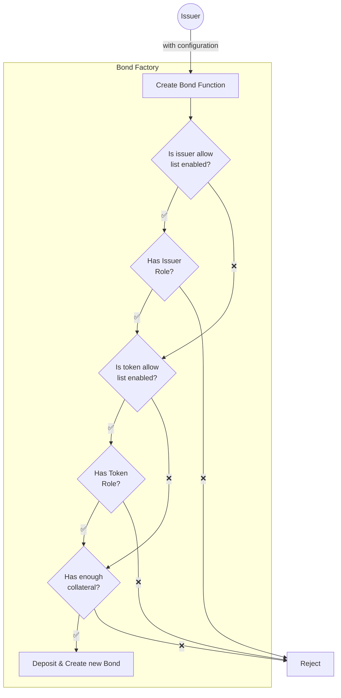

# V1 Architecture

The V1 Architecture consists of a [Bond](/contracts/Bond.sol) and an OpenZeppelin clone factory, [BondFactory](/contracts/BondFactory.sol), to create new instances of the Bond contract.

## Entities

The two entities, Bond and BondFactory, make up the protocol.

An Issuer (EOA) first creates a Bond comprised of many bond shares via the BondFactory. The Issuer can then distribute those bond shares to BondHolder(s) (EOA(s)).

## Lifecycle

A typical lifecycle starts from issuance and ends when all bond shares have either been redeemed / converted by the bond holders, or burnt by the issuer.

### 1. Porter Finance Initializes BondFactory Contract

The Bond Factory contract is deployed by the Porter Admin (multi-sig). The contract assigns the admin role to the deployer and the proxy contract is [initialized](/contracts/BondFactory.sol#L97) with the token implementation (Bond contract).

### 2. Issuer Contacts Porter Finance

- Porter Finance evaluates Issuer's credit worthyness
- Porter Finance creates parameters for the issuance
  - Amount of ERC20 token backing each share (Collateral Token)
  - Amount of collateral each share would convert into
  - Maturity date
  - Total issuance size
  - The ERC20 token the Bond is denominated in (Payment Token)
- Porter Finance adds Issuer to allow list
- Porter Finance adds Collateral Token & Payment Token to allow list

### 3. Issuer Creates a Bond

After the issuance has been approved, the issuer will be on the allowed issuer list and their intended collateral token and payment token will be added to the allowed token list. The Bonds are created (minted) at the same time that the collateral is deposited. After a Bond is created, the issuer can sell the Bond through the [Porter Finance App](https://app.porter.finance) (we use [Gnosis' Batch Auction](https://github.com/gnosis/ido-contracts)).

These are sold as [Zero Coupon Bonds](https://docs.porter.finance/portal/financial-concepts/zero-coupon-bonds). Another party will purchase these bond shares at a discount by paying with the Payment Token. The purchasers are known as **bond holders**. At maturity, the bond holders can redeem their bond shares at 1 to 1 for Payment Tokens.

## Bond States

Issuers and Bond Holders can both interact with the bond in a few ways. For a simpler view, look at the [state transition diagram](/spec/stateMachine.md). Since the Bond is an ERC20 token, the bond shares may be **`transferred`** at any time by any users.

### Issuer States

Issuers can also be thought of as bond holders. In addition to the actions taken by bond holders, Issuers have the ability to **`pay`**, **`withdrawExcessCollateral`**, **`withdrawExcessPayment`** and **`sweep`**. These can be called at any time to affect the Bond.

#### Decrease of collateral requirement

There are three ways in which the collateral requirement can decrease. At any time, the Issuer may `withdrawExcessCollateral` from the contract in order to reclaim some of their collateral.

1. The total number of bond shares decrease.
   - Issuers may **`burn`** their excess bonds.
   - Bond Holders may **`convert`** their bonds before maturity.
2. The amount of Payment Tokens in the contract covers a portion of the bond shares.
   - Issuers may **`pay`** a portion of the Payment Token to the contract.
3. (For a convertible bond) The Bond has reached maturity and no longer requires collateral for convertibility.
   - After maturity, the locked collateral required to potentially convert all bonds is lifted.

#### Decrease of payment requirement

There are ways in which the payment requirement can decrease. At any time, the Issuer may also `withdrawExcessPayment` to reclaim any excess Payment Token in the contract.

1. The total number of bond shares decrease.
   - Issuers may **`burn`** their excess bonds.
   - Bond Holders may **`convert`** their bonds before maturity.

#### ERC20 Token Accidentally Sent

The Issuer has a utility function, **`sweep`** available to retrieve any ERC20 token sent to the Bond contract by mistake.

### Bond Holder States

The Bond Holders can interact with the Bond contract in different ways before and after maturity is reached.

#### Before Maturity

1. (For a convertible bond) The bond holders may **`convert`** their bond shares into the underlying collateral at a pre-determined ratio.
2. The bond holders may **`redeem`** for Payment Token if the bond is fully paid.

#### After Maturity

1. The bond holders may **`redeem`** the bond.
   - If the bond is fully paid, redemption will be for Payment Token
   - If the bond has no payment, redemption will be for Collateral Token
   - If the bond is partially paid, redemption will be for a pro-rata amount of Payment Token & Collateral Token
