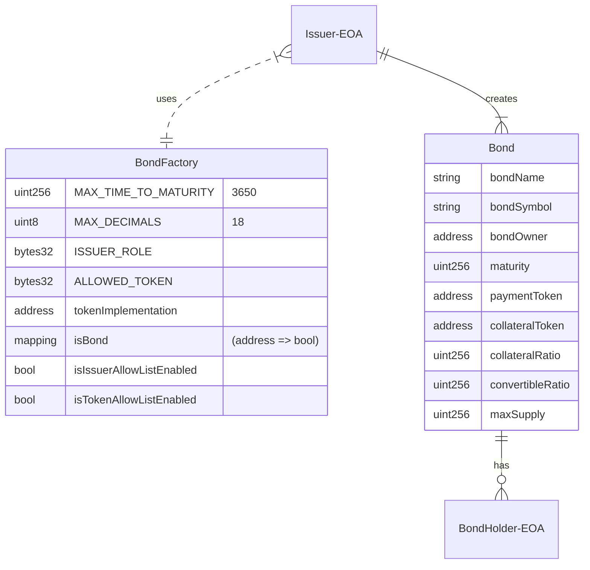
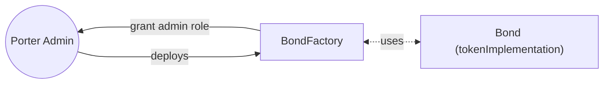
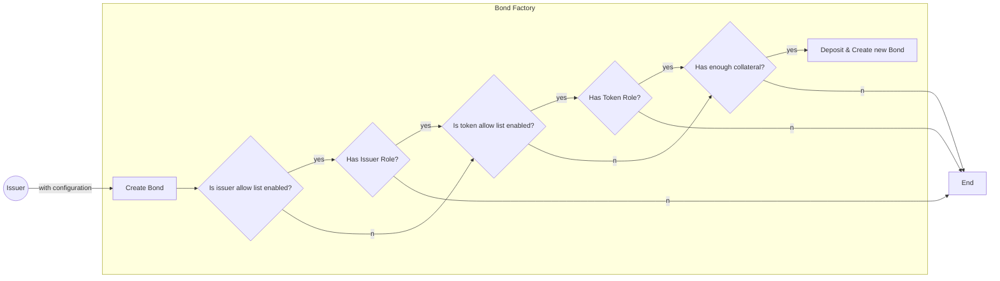
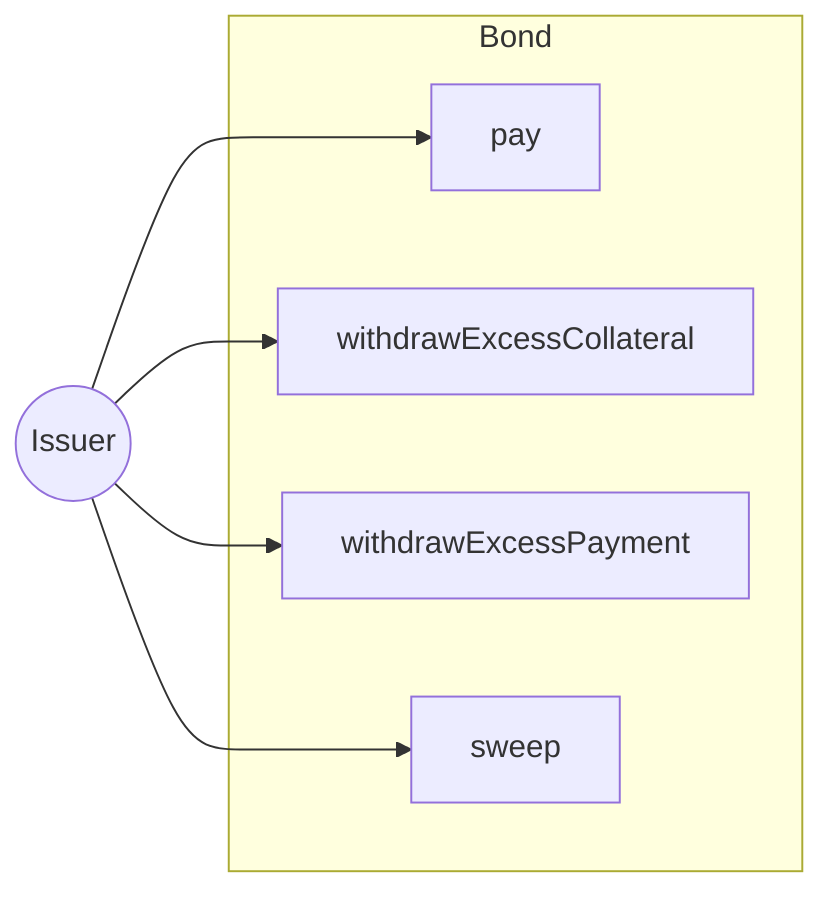
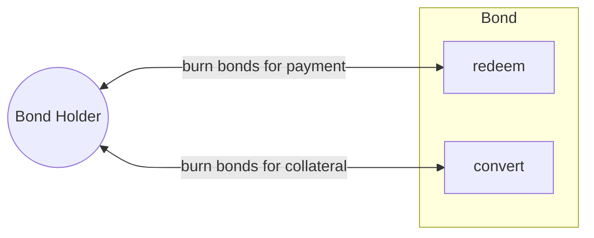

# V1 Architecture

The V1 Architecture consists of a [Bond](/contracts/Bond.sol) and an OpenZeppelin clone factory, [BondFactory](/contracts/BondFactory.sol), to create new instances of the Bond contract.

## Entities
The two entities, Bond and BondFactory, make up the protocol.  

An Issuer (EOA) first creates a Bond comprised of many bond shares via the BondFactory. The Issuer can then distribute those bond shares to BondHolder(s) (EOA(s)).  

## Lifecycle

A typical lifecycle starts from issuance and ends when all bond shares have either been redeemed / converted by the bond holders, or burnt by the issuer.

### 1. Porter Finance Initializes BondFactory Contract
The Bond Factory contract is deployed by the Porter Admin (multi-sig). The contract assigns the admin role to the deployer and the proxy contract is [initialized](/contracts/BondFactory.sol#L97) with the token implementation (Bond contract).

### 2. Issuer Contacts Porter Finance
   - Porter Finance evaluates Issuer's credit worthyness
   - Porter Finance creates parameters for the issuance
     - Amount of ERC20 token backing each share (Collateral Token)
     - Amount of collateral each share would convert into
     - Maturity date 
     - Total issuance size
     - The ERC20 token the Bond is denominated in (Payment Token)
   - Porter Finance adds Issuer to allow list
   - Porter Finance adds Collateral Token & Payment Token to allow list
   
### 3. Issuer Creates a Bond
After the issuance has been approved, the issuer will be on the allowed issuer list and their intended collateral token and payment token will be added to the allowed token list. The Bonds are created (minted) at the same time that the collateral is deposited. After a Bond is created, the issuer can sell the Bond through the [Porter Finance App](https://app.porter.finance) (we use [Gnosis' Batch Auction](https://github.com/gnosis/ido-contracts)).

These are sold as [Zero Coupon Bonds](https://docs.porter.finance/portal/financial-concepts/zero-coupon-bonds). Another party will purchase these bond shares at a discount by paying with the Payment Token. The purchasers are known as **bond holders**. At maturity, the bond holders can redeem their bond shares at 1 to 1 for Payment Tokens.

### Bond Actions
Issuers and Bond Holders can both interact with the bond in a few ways.

#### Issuers

#### Bond Holders

